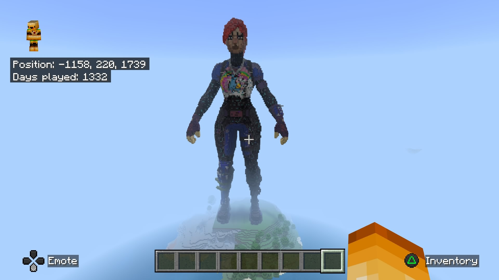

# voxelart - Create voxel art for Minecraft BE worlds




## Installation

```console
pipx install git+https://github.com/bedrock-ws/voxelart.git
```


## Usage

```console
voxelart share
```

`share` is a path to a directory containing 3D models. Within Minecraft the
player can write `%foo/bar/model` in the chat which would "print" the model
located at `share/foo/bar/model.xyzrgb` into the Minecraft world.

You can override the address and port with their appropiate flags `--address`
and `--port` (e.g. `voxelart --address localhost --port 8000 share`).


## Tutorial

1. Voxelize your 3D model with <https://github.com/Eisenwave/obj2voxel> (e.g.
   `obj2voxel model.obj model.xyzrgb -r 90`).
2. Put the `.xyzrgb` files in a directory named `share`.
3. Launch Minecraft.
4. Connect to the websocket with /connect XXX.XXX.XX.XXX:6464 (insert the IP
   address of the server).
5. Go to an area in your Minecraft world that is far away from your beloved
   creations.
6. Generate the 3D model by typing `%share/model`

> [!TIP]
> Ensure the entire area is loaded properly.


## Commands

- `%foo` - Place the model named `foo`
- `&swapxz yes` - Swap X and Z coordinates when placing model
- `&swapxz no` - Don't swap X and Z coordinates when placing model


## Links

- [Troubleshooting](https://bedrockpy.readthedocs.io/en/latest/troubleshooting.html)
- [OBJ sample files](https://people.sc.fsu.edu/~jburkardt/data/obj/obj.html)
